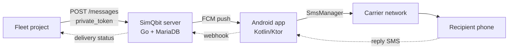

<div align="center">

# SimQbit

*A real SIM, made programmable.*

[](https://github.com/kariemSeiam/simqbit/actions/workflows/ci.yml)
[](LICENSE)
[](docker-compose.yml)
[](https://github.com/android-sms-gateway/server)
[](https://github.com/capcom6/android-sms-gateway)

<sup>Internal SMS gateway for the fleet. No Twilio. No virtual numbers. No SaaS dependency for something that should just live on a spare phone.</sup>

**[Why](#why) · [Quickstart](#quickstart) · [Pairing a device](#pairing-a-device) · [Sending a message](#sending-a-message) · [Architecture](#architecture) · [Comparison](#why-this-fork) · [FAQ](#faq)**

</div>

<br>

---

<br>

> [!NOTE]
> **This repo is a deployment wrapper, not the SMS gateway's source
> code.** It has no application code of its own — that's not an
> oversight, it's the point. It is `docker-compose.yml` +
> `configs/*.yml` + this README, wiring together two things that
> already exist and are already good:
>
> - **Server** — the prebuilt image `ghcr.io/android-sms-gateway/server`
>   (Go, Apache-2.0, source: [`android-sms-gateway/server`](https://github.com/android-sms-gateway/server))
> - **Android app** — the APK from [`capcom6/android-sms-gateway` releases](https://github.com/capcom6/android-sms-gateway/releases),
>   installed on a real phone with a real SIM
>
> `docker compose up -d` pulls the server image and a MariaDB image —
> nothing is built from source in this repo. If you want the actual
> gateway source to read or modify, go to those two upstream repos;
> this one exists so the fleet doesn't reinvent the deploy config for
> each project that needs SMS.

<br>

> [!IMPORTANT]
> No Android device is paired yet. The server runs and passes health
> checks, but no real SMS flows until a phone is registered — see
> [Status](#status).

## Why

Any internal project needs to send
OTPs, order confirmations, or alerts by SMS. The usual answer is a
per-message API like Twilio — expensive, and often unavailable for
local numbers outside a handful of supported countries.

```text
your code ──POST /messages──> SimQbit ──push──> phone ──real SIM──> recipient
```

| Instead of… | You get… |
|---|---|
| Paying per-message to Twilio/MessageBird | Your own SIM's carrier plan — often flat-rate or unlimited |
| A virtual number that doesn't exist for your country | Your real SIM, your real local number |
| Trusting a third party with message content | Self-hosted, AES-256 end-to-end encryption to the device |
| AGPL-licensed forks that leak into your product's license | Apache-2.0 throughout — no copyleft obligation |
| A managed cloud dependency for a purely internal tool | Bound to `127.0.0.1`, reachable only from the fleet's own network |

The name: **Sim** (the physical SIM/Android device layer) + **Qbit**
(each message/device treated as a routable, software-controlled unit).

### What it refuses

- **No cloud account required.** Private mode only — this server is
  yours, not a SaaS tenant.
- **No bulk-sending pretense.** Built for OTPs and transactional
  alerts at carrier-limited volume, not marketing blasts.
- **No secrets in git, ever.** Every credential is `openssl rand`,
  gitignored, scanned on every push (see [CI](.github/workflows/ci.yml)).

### What it bets on

- The upstream project (`android-sms-gateway`) outlives this wrapper —
  5,600+ stars, active maintenance, real performance work in its
  commit history.
- One paired phone is enough for internal fleet traffic. Multi-device
  is supported upstream if that stops being true.

## Architecture



Built on [`android-sms-gateway/server`](https://github.com/android-sms-gateway/server)
(Go, Apache-2.0) — the highest-starred, most actively engineered
open-source Android SMS gateway backend available (see
[Why this fork](#why-this-fork)). Deploys as two Docker containers: the
gateway server itself and its MariaDB store.

## Status

| Component | State |
|---|---|
| Server | Running, healthy (`docker compose ps`) |
| Database | Migrated, healthy |
| Android device | Not yet registered — no real SMS flows until one is paired |
| Public exposure | None — bound to `127.0.0.1:3900`, internal-only |

## Quickstart

```bash
git clone <this-repo-url> simqbit
cd simqbit
cp configs/config.example.yml configs/config.yml
cp .env.example .env   # fill in real secrets, chmod 600 .env
docker compose up -d
curl http://127.0.0.1:3900/api/3rdparty/v1/health/live
```

## Pairing a device

1. Install the APK from
   [`capcom6/android-sms-gateway` releases](https://github.com/capcom6/android-sms-gateway/releases)
   on a spare Android phone with a real SIM.
2. In the app, switch to **Cloud mode** and point it at this server's
   address (reachable from the phone's network — not `127.0.0.1`, use
   the VPS's internal/Tailscale address).
3. Register the device using the `private_token` from `configs/config.yml`.
4. Send a test message via the API (see below) and confirm it lands on
   the phone.

## Sending a message

```bash
curl -X POST http://127.0.0.1:3900/api/3rdparty/v1/messages \
  -H "Content-Type: application/json" \
  -H "Authorization: Bearer <device-token>" \
  -d '{
    "textMessage": {"text": "Hello from SimQbit"},
    "phoneNumbers": ["+201234567890"]
  }'
```

Full API surface: `/api/3rdparty/v1/{messages,devices,webhooks,inbox,settings,logs}`.
OpenAPI schema served when `http.openapi.enabled: true` (already set in
`configs/config.example.yml`).

## Why this fork

Evaluated against `NdoleStudio/httpsms` and `textbee/textbee` before
choosing `android-sms-gateway` as the base for this deployment —
researched, not assumed (verified stars/license/topics via the GitHub
API at time of writing):

| | SimQbit (on `android-sms-gateway`) | `NdoleStudio/httpsms` | `textbee/textbee` |
|---|---|---|---|
| License | Apache-2.0 | AGPL-3.0 | MIT |
| Stars (upstream) | 5,600+ | 4,600+ | 3,000+ |
| Local mode (zero cloud dependency) | ✅ | ❌ | ❌ |
| Multi-SIM support | ✅ | ❌ | ✅ (Pro tier) |
| MMS support | ✅ | ❌ | ❌ |
| Rate limiting per device | ✅ | ❌ | ❌ |
| Prometheus/Grafana shipped in-repo | ✅ | ❌ | ❌ |
| JWT with token revocation | ✅ | Basic auth only | API key only |
| End-to-end encryption | AES-256-CBC/PBKDF2 | ❌ | ❌ |
| Server language | Go | Go | Node.js/NestJS |
| App stack | Kotlin/Ktor (modern) | — | Kotlin + Java (mixed legacy) |

<details>
<summary>Why AGPL-3.0 mattered enough to rule out httpsms</summary>

AGPL requires that anyone who runs a modified version of the software
as a network service must publish their modified source. For an
internal fleet tool that might later wrap this in a paid or
client-facing product, that's a real constraint — Apache-2.0 carries
no such obligation. This is a licensing decision, not a quality
judgment on httpsms itself, which is a solid, actively maintained
project.

</details>

## Repository layout

```text
simqbit/
├── .github/workflows/ci.yml  # markdownlint + compose validate + secret scan on every push
├── configs/
│   └── config.example.yml    # template; copy to config.yml (gitignored) and fill in real values
├── docker-compose.yml        # server + MariaDB, secrets via .env (gitignored)
├── .env.example               # template; copy to .env (gitignored, chmod 600)
├── .gitignore
├── .markdownlint.json         # same lint config CI runs against
├── LICENSE                    # Apache-2.0
└── README.md
```

Not tracked, created locally by `Quickstart` below: `configs/config.yml`,
`.env` — both real-secret files, both gitignored.

## Security notes

- All secrets are generated with `openssl rand`, never hand-typed.
- `docker-compose.yml` references `${DB_ROOT_PASS}`/`${DB_PASS}` only —
  no literal credentials committed, ever.
- Server bound to `127.0.0.1` — not reachable from outside the host
  unless deliberately proxied (e.g. via Tailscale or a reverse proxy
  with its own auth).
- GitHub secret scanning, push protection, and Dependabot security
  updates enabled on this repo.

## FAQ

<details>
<summary><b>Does my carrier limit how many messages I can send this way?</b></summary>
<br>

Yes — this uses `SmsManager` over your real SIM, so normal carrier
rate limits and anti-spam policies apply. It's built for
low-to-moderate internal traffic (OTPs, order confirmations, alerts),
not bulk marketing sends — see [What it refuses](#what-it-refuses).
If you need real volume, this isn't the tool; go get a proper bulk
SMS provider instead of fighting carrier throttling.

</details>

<details>
<summary><b>What happens if the phone loses connectivity or dies?</b></summary>
<br>

Messages queue server-side (`messages:list`/`messages:cancel` API) and
the health endpoint reports device online/offline state (see
[Status](#status)). There's no automatic failover to a second device
yet — pairing a second phone is supported by the upstream server, but
this deployment's `config.yml` targets one device. If single-device
availability isn't good enough for what you're building, pair a
second phone before you need it, not after it goes down.

</details>

<details>
<summary><b>Why not just use Twilio and eat the cost?</b></summary>
<br>

For a handful of Egyptian numbers reachable at volume, most
virtual-number providers either don't support local numbers or charge
per-message well above local carrier rates (see [Why](#why)). This
trades that recurring cost for one spare phone and a SIM you already
pay for. If your project needs numbers in a dozen countries with SLA
guarantees, that tradeoff runs the other way — use Twilio.

</details>

<details>
<summary><b>Is this production-hardened, or a prototype?</b></summary>
<br>

The upstream (`android-sms-gateway/server`) is: 5,600+ stars, JWT auth
with token revocation, rate limiting, Prometheus/Grafana shipped
in-repo, active commit history with real performance work (see
[Comparison](#why-this-fork)). This repo is the deployment wrapper
(Docker Compose + MariaDB + secrets discipline) around that — it has
not yet been used to send a single real message. Don't point anything
customer-facing at it until [Status](#status) says a device is paired
and this line is gone.

</details>

<details>
<summary><b>Why not build this into each project instead of a shared service?</b></summary>
<br>

Because that's how you end up with three different Twilio
integrations, three different secret rotations, and three different
bugs in the same SMS-delivery code — one per project. SimQbit exists
so the fleet pays that cost once. If you only ever have one project
that needs SMS, a shared service is overhead you don't need yet —
vendor it directly and skip this.

</details>

## Acknowledgments

Built on top of [`android-sms-gateway`](https://github.com/capcom6/android-sms-gateway)
(Android app) and [`android-sms-gateway/server`](https://github.com/android-sms-gateway/server)
(backend) by [capcom6](https://github.com/capcom6) and contributors —
both Apache-2.0. This repository packages a private deployment
(Docker Compose + MariaDB) for internal fleet use; it does not modify
their source.

## License

[Apache License 2.0](LICENSE) — same license as the upstream projects
this deployment is built on.

---

<br>

<div align="center">

*A SIM card was always a real, addressable endpoint on a network.*
*SimQbit doesn't invent that — it just stops making you forget it.*

<br>

**[kariemSeiam/simqbit](https://github.com/kariemSeiam/simqbit)** · Apache-2.0

</div>
